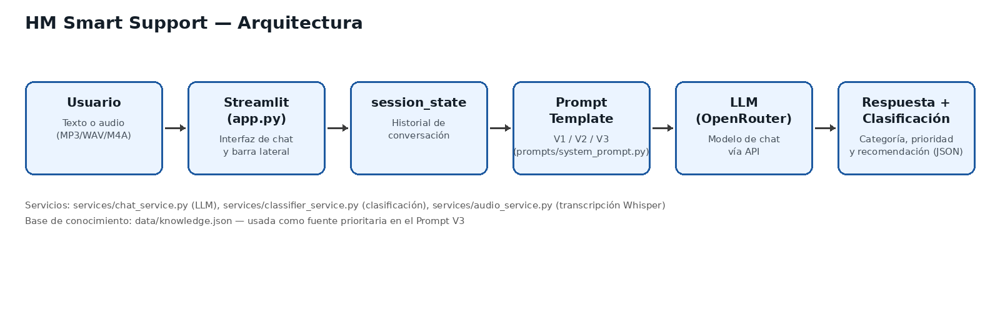

# 🧵 HM Smart Support
Asistente inteligente multimodal de postventa para **Hilos y Máquinas S.A.C.** (TA2 – Herramientas de Desarrollo Profesional TIC, UTP).

Funciones: chatbot con contexto (`st.session_state`), transcripción de audio (MP3/WAV/M4A), clasificación por categoría y prioridad (JSON), prompts V1/V2/V3 seleccionables.

## Arquitectura
```
Usuario → Texto/Audio → Streamlit → session_state → Prompt Template → LLM (OpenRouter) → Respuesta + Clasificación

```
| Componente | Archivo |
|---|---|
| Interfaz | `app.py` |
| Prompts V1/V2/V3 y clasificador | `prompts/system_prompt.py` |
| Chat / API OpenRouter | `services/chat_service.py` |
| Transcripción (Whisper local) | `services/audio_service.py` |
| Clasificación | `services/classifier_service.py` |
| Base de conocimiento | `data/knowledge.json` |

## Instalación
```bash
git clone <[URL_DEL_REPOSITORIO](https://github.com/NayelyYomaraMachacuayYantas/HM-SmartSupport.git)>
cd HM-SmartSupport
python -m venv .venv
# Windows: .venv\Scripts\activate    |  Mac/Linux: source .venv/bin/activate
pip install -r requirements.txt
cp .env.example .env      # Windows: copy .env.example .env
# Edita .env y pega tu OPENROUTER_API_KEY
streamlit run app.py
```

## Pruebas
```bash
pytest -q                              # unitarias (sin API)
python tests/compare_prompts.py        # evidencia V1 vs V2 vs V3 -> evidence/
python tests/run_evaluation.py         # 12 casos -> evidence/matriz_pruebas.csv
python tests/run_evaluation.py --metrics
```
Audios de prueba (casos 8-10): `tests/audio/caso08.wav`, `caso09.mp3|m4a`, `caso10.wav`.

## Seguridad
La API Key vive solo en `.env` (ignorado por Git). Nunca la subas al repositorio.

## Integrantes
- Kiara Yuriko Padilla Riveros
- Nayely Yomara Machacuay Yantas
- Liesel Lina Reyda Zamora Quispe
